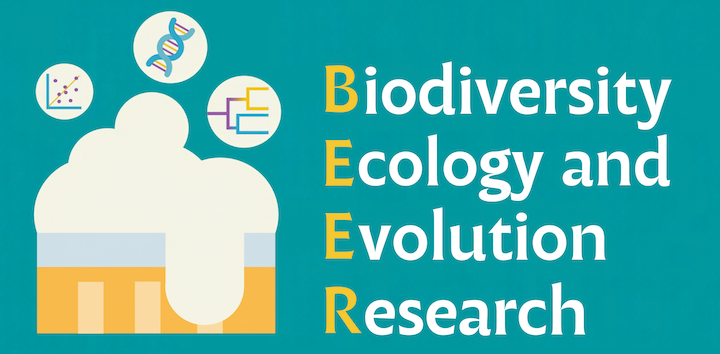

::: {.hero}

BEER LAB: Biodiversity, Ecology and Evolution Research Lab

Department of Botany · Faculty of Science · Kasetsart University, Bangkok

:::

::: {.lead-block}
Our lab studies a wide range of questions about biodiversity from ecological and evolutionary perspectives. We enjoy integrating classical approaches with molecular and statistical techniques. While we work mostly with **bryophytes and lichens**, we dabble with flowering plants — and even animals — sometimes!
:::

We are based at the **Botanical Knowledge Museum**, Department of Botany, Kasetsart University in Bangkok, Thailand ([map](https://www.google.com/maps/search/?api=1&query=Department+of+Botany+Faculty+of+Science+Kasetsart+University+Bangkok)). Inquiries can be directed to our PI at [ekaphan.k@ku.th](mailto:ekaphan.k@ku.th).

::: {.thai-block .th lang="th"}
กลุ่มงานวิจัยของเราสนใจงานด้านความหลากหลายทางชีวภาพ นิเวศวิทยา และวิวัฒนาการของพืช โดยเฉพาะอย่างยิ่งกลุ่มไบรโอไฟต์และไลเคน แต่เรายังศึกษาพืชดอกและสัตว์ชนิดอื่น ๆ อีกด้วย โดยใช้ข้อมูลที่หลากหลายประกอบกับวิธีการทางสถิติสมัยใหม่

สามารถพบกลุ่มวิจัยเราได้ที่พิพิธภัณฑ์องค์ความรู้ทางพฤกษศาสตร์ ภาควิชาพฤกษศาสตร์ คณะวิทยาศาสตร์ มหาวิทยาลัยเกษตรศาสตร์ ([แผนที่](https://www.google.com/maps/search/?api=1&query=Department+of+Botany+Faculty+of+Science+Kasetsart+University+Bangkok)) หากต้องการติดต่อกลุ่มวิจัยหรือร่วมงาน สามารถติดต่อได้ที่ [ekaphan.k@ku.th](mailto:ekaphan.k@ku.th)
:::
:::

## 🙋🏻‍♂️ What we ask

::: {.card-grid}
::: {.tile}
### How many species are there?
Floristics and systematics: integrative taxonomy through multiple lines of evidence.
:::
::: {.tile}
### What maintains diversity in a community?
Community assembly on leaves, bark and other tiny habitats, across space and time.
:::
::: {.tile}
### Where does diversity come from?
Evolutionary ecology and phylogenetics of diversification.
:::
:::

[More on our research →](research.qmd)

## 📝 Recent publications



[Full publication list →](publications.qmd)
