<!--
HOW TO EDIT THIS PAGE
- Each person is one ::: {.person} block. Copy a block to add someone.
- Photo: put a square image in images/people/ and replace the initials inside
  ::: {.avatar} with  
- When someone graduates, move their block under Alumni, inside the right
  "Class of" heading, change their name heading to #### and add a
  [Degree · Class of YYYY]{.role} line.
-->

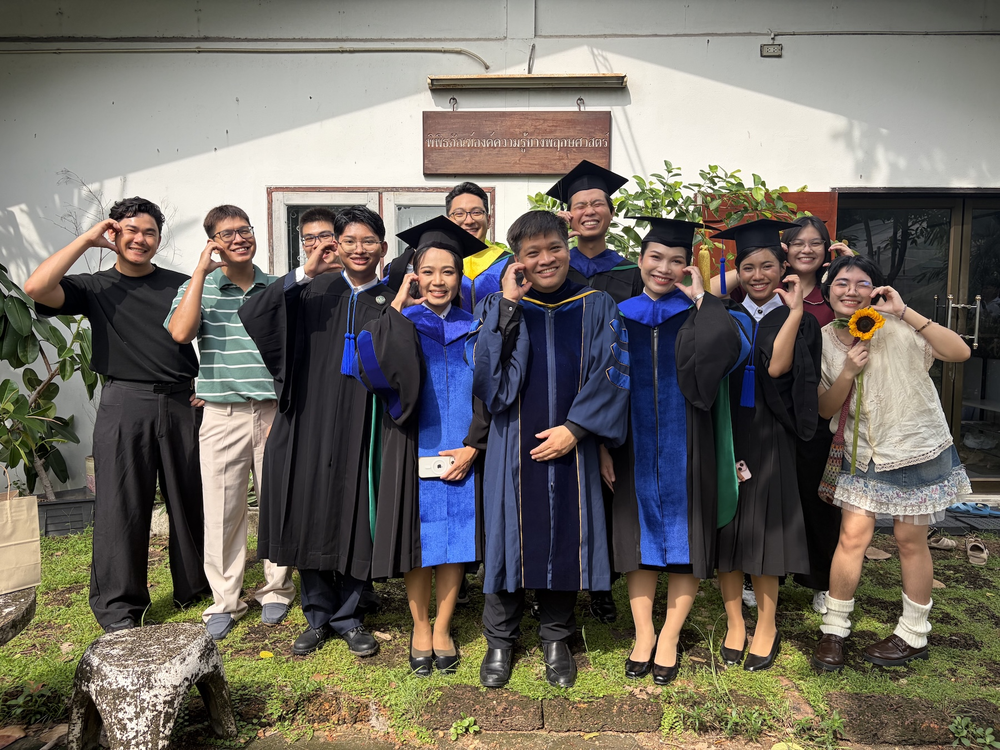

## Principal Investigator

::: {.person}
::: {.avatar}

:::
::: {}
### Ekaphan Kraichak (Bier), Ph.D.
[Associate Professor & Chair, Department of Botany]{.role}

My training is in the diversity and ecology of bryophytes and lichens. I have become more involved in phylogenetics, genetic diversity, and statistics in biology in general. R enthusiast!

- A.B., Biology (Honors) with minor in Education Studies, Bowdoin College, USA (2008)
- Ph.D., Integrative Biology, University of California, Berkeley, USA (2013)
- Postdoctoral Research, Field Museum of Natural History, Chicago, USA (2013 - 2014)
- Associate Professor, Department of Botany, Kasetsart University, Thailand (2015 - Present)

[[ekaphan.k@ku.th](mailto:ekaphan.k@ku.th) · [ORCID](https://orcid.org/0000-0002-8437-2180) · [YouTube](https://www.youtube.com/@ajarnbier)]{.contact}
:::
:::
## Master's Students

::: {.person}
::: {.avatar}
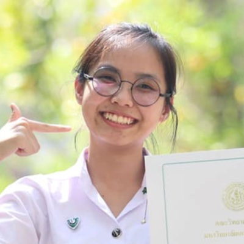
:::
::: {}
### Siwaporn Jansantia (Fah)
Expertise
: Bryophytes, duckweeds, plant ecology

Current research
: Effect of culture medium concentration on the growth of duckweed species
:::
:::

::: {.person}
::: {.avatar}
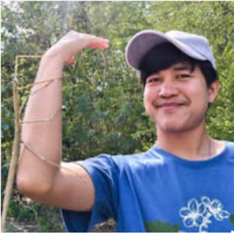
:::
::: {}
### Suraphong Kosum (Mos)
Expertise
: Duckweeds, plant taxonomy, biodiversity

Current research
: Temporal changes and associated factors of duckweeds within natural ponds of Bangkok

:::
:::

::: {.person}
::: {.avatar}

:::
::: {}
### Taratorn Munsuwan (Nam)
Expertise
: Computational Biology, Duckweed Biology

Current research
: Effects of Cytokinin on Duckweed Growth
:::
:::

::: {.person}
::: {.avatar}
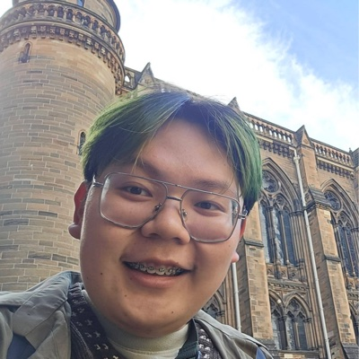
:::
::: {}
### Peeraphat Thanasoot (Tonkhaw)
Expertise
: Angiosperms, Phylogenetics

Current research
: Past, Present, Future: Evolution of Wild Ginger (*Zingiber*) under Climatic Niches

:::
:::

## Undergraduate Students

::: {.person}
::: {.avatar}

:::
::: {}
### Nannapat Lertritsirikul (Fai)
Current research
: Commercial Bryophytes in Thailand
:::
:::

::: {.person}
::: {.avatar}

:::
::: {}
### Phongsathon Intharadet (New)
Current research
: Effects of Agricultural Land Uses on Lichen Community
:::
:::

::: {.person}
::: {.avatar}
PS
:::
::: {}
### Paramate Sittikrai (Ko)
Current research
: Effect of initial density of *Wolffia* on the population growth
:::
:::

::: {.person}
::: {.avatar}
AI
:::
::: {}
### Anuphat Inliang (Time)
Current research
: Effects of Drought Stress on Stomatal Density in Seedlings of Eleven Tree Species
:::
:::

## Alumni

::: {.alumni-year}

### Postdoctoral Alumni

::: {.person}
::: {.avatar}
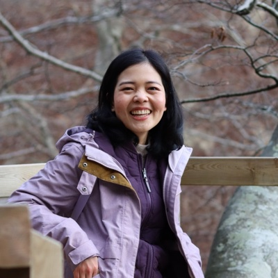
:::
::: {}
#### Natthawadi Wongthet (Praew), Ph.D.
[Postdoctoral Researcher]{.role}

Expertise
: Phytochemistry, phylogenetics, bioactivities, *Clausena*

Project
: An integrative perspective into the endemic diversity of *Maerua siamensis*

:::
:::

### Class of 2025

::: {.person}
::: {.avatar}

:::
::: {}
#### Kanokporn Promnikorn (Fonn)
[Ph.D. Botany (2025) · M.S. Botany (2019)]{.role}

Expertise
: Species distribution models, geospatial analysis, agricultural data analysis

Project (Ph.D.)
: Systematic Review, Meta-analysis, and the Uses of Satellite Data for Monitoring and Predicting Cassava Productivity

Project (M.S.)
: Species distribution modeling of *Vitex glabrata*

:::
:::

::: {.person}
::: {.avatar}

:::
::: {}
#### Athita Senayai (Aim)
[Ph.D. Botany · Class of 2025]{.role}

Expertise
: Bryophytes, duckweeds

Project
: Genetic and Biochemical Diversity, and Demographic Senescence of Some Duckweed Species in Thailand

:::
:::

::: {.person}
::: {.avatar}

:::
::: {}
#### Akekachoke Buranaanun (M)
[M.S. Botany · Class of 2025]{.role}

Expertise
: Ornithology, plant taxonomy, bryophytes, pteridophytes, citizen science

Project
: Utilization of Bryophytes as Nest Materials in Passerine Birds in Doi Inthanon National Park

:::
:::

::: {.person}
::: {.avatar}
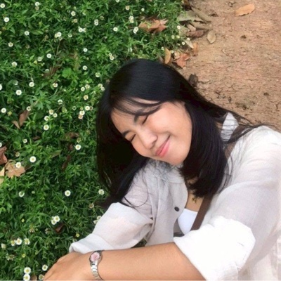
:::
::: {}
#### Onpreeya Kachakun (Fai)
[B.S. Botany · Class of 2025]{.role}

Project
: Variation of morphology and anatomy within some species of *Pogonatum* in Thailand
:::
:::

::: {.person}
::: {.avatar}
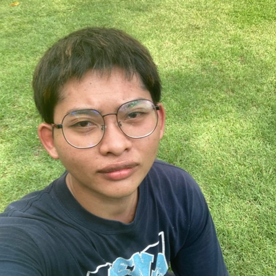
:::
::: {}
#### Sukkarin Klinklan (Lay)
[B.S. Botany · Class of 2025]{.role}

Project
: Modeling of potential distribution of *Neltuma juliflora* (Sw.) Raf. in Southeast Asia and South Asia
:::
:::

::: {.person}
::: {.avatar}

:::
::: {}
#### Kanokporn Muangliang (Mew)
[B.S. Botany · Class of 2025]{.role}

Project
: Species Distribution Modeling of Charophyte in Thailand
:::
:::

::: {.person}
::: {.avatar}
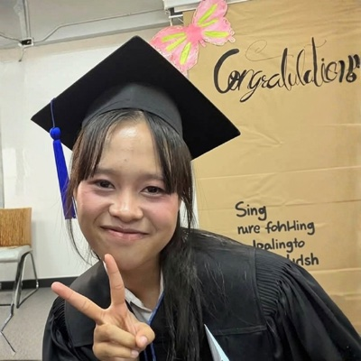
:::
::: {}
#### Supharada Sinual (Fern)
[B.S. Botany · Class of 2025]{.role}

Project
: Monitoring Changes in Duckweed Abundance and Related Environmental Factors in Summer Season
:::
:::

::: {.person}
::: {.avatar}
MI
:::
::: {}
#### Miah Imduaikiat (Miah)
[B.S. Biology, MUIC · Class of 2025]{.role}

Project
: DNA barcoding of charophyceaous species from Thailand
:::
:::

### Class of 2024

::: {.person}
::: {.avatar}

:::
::: {}
#### Nitipat Trainitipong (Tae)
[B.S. Botany · Class of 2024]{.role}

Project
: Developing a height-diameter allometry equation for Teak (*Tectona grandis*) in Thailand
:::
:::

::: {.person}
::: {.avatar}
TP
:::
::: {}
#### Tanapon Panyatanasub (Gordon)
[B.S. Biology, MUIC · Class of 2024]{.role}

Project
: Molecular identification of commercial crickets from Thailand using mitochondrial cytochrome c oxidase subunit I sequence
:::
:::

### Class of 2023

::: {.person}
::: {.avatar}
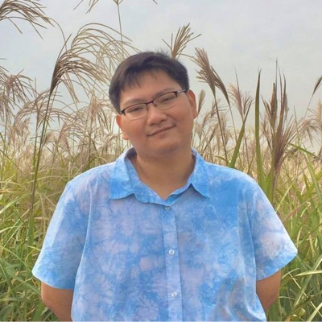
:::
::: {}
#### Patsakorn Tiwutanon (Pea)
[Ph.D. Botany · Class of 2023]{.role}

Project
: Systematics of the moss genus *Leucobryum* in Thailand
:::
:::

::: {.person}
::: {.avatar}

:::
::: {}
#### Puwadol Chawengkul (Pooh)
[M.S. Botany · Class of 2023]{.role}

Project
: Species distribution modeling of *Leucobryum* from SE Asia under future climate change
:::
:::

::: {.person}
::: {.avatar}
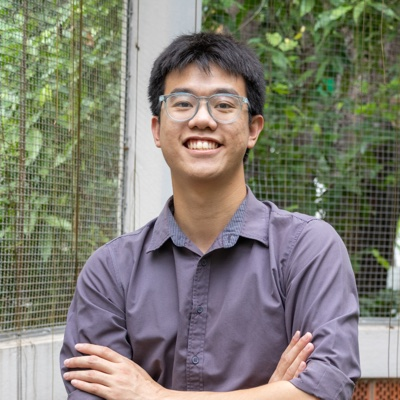
:::
::: {}
#### Nopparat Anantaprayoon (Opal)
[M.S. Botany (2023) · B.S. Botany (2018)]{.role}

Project (M.S.)
: Diversification of the liverwort family Aneuraceae

Project (B.S.)
: Integrative taxonomy of the genus *Aneura* in Thailand

:::
:::

::: {.person}
::: {.avatar}
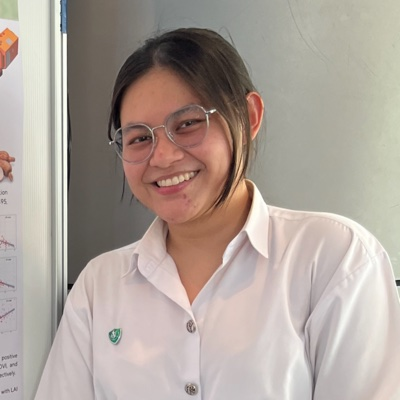
:::
::: {}
#### Thanpitcha Jenkit (Pran)
[B.S. Botany · Class of 2023]{.role}

Project
: Comparing the efficiency of vegetation indices in predicting cassava yield
:::
:::

### Class of 2022

::: {.person}
::: {.avatar}
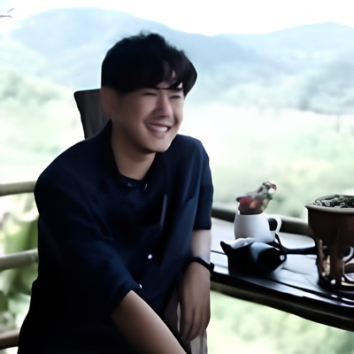
:::
::: {}
#### Sangsuree Thippawan (Art)
[M.S. Botany (2022) · B.S. Botany (2018)]{.role}

Project (M.S.)
: Biomass modeling of seedlings from dry evergreen forest in Huai Kha Khaeng Wildlife Sanctuary

Project (B.S.)
: Epiphytic lichens and bryophytes by host species and size in the Khao Chong plot

:::
:::

::: {.person}
::: {.avatar}
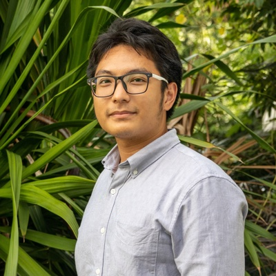
:::
::: {}
#### Napat Jantaraprasot (Pump)
[M.S. Botany · Class of 2022]{.role}

Project
: Morphological and genetic diversity of *Dioscorea* cultivars in Thailand
:::
:::

::: {.person}
::: {.avatar}

:::
::: {}
#### Siwaporn Jansantia (Fah)
[B.S. Botany · Class of 2022]{.role}

Project
: Terricolous bryophytes in Sakaerat Environmental Research Station
:::
:::

::: {.person}
::: {.avatar}

:::
::: {}
#### Thanyalak Phuthanakul (Nuch)
[B.S. Botany · Class of 2022]{.role}

Project
: Stand structure and environments of white samet in Rayong Botanical Garden
:::
:::

### Class of 2021

::: {.person}
::: {.avatar}

:::
::: {}
#### Phiraon Carcaiso (Julia)
[B.S. Biology, MUIC · Class of 2021]{.role}

Project
: Potential for DNA barcoding in crickets
:::
:::

::: {.person}
::: {.avatar}

:::
::: {}
#### Chayaporn Lakmaung (Bell)
[B.S. Botany · Class of 2021]{.role}

Project
: DNA barcoding of Thai *Leptolejeunea*
:::
:::

::: {.person}
::: {.avatar}
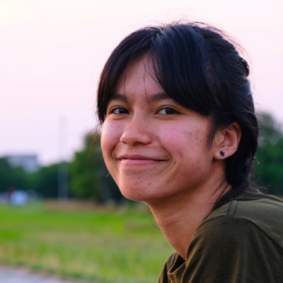
:::
::: {}
#### Kanchaphorn Ratchasong (Nan)
[B.S. Botany · Class of 2021]{.role}

Project
: Ecology of urban duckweeds
:::
:::

### Class of 2020

::: {.person}
::: {.avatar}
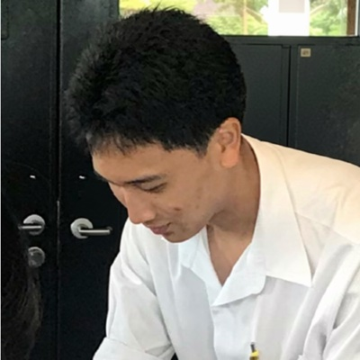
:::
::: {}
#### Kasidis Chaiyasit (France)
[B.S. Biology, MUIC · Class of 2020]{.role}

Project
: Phylogenetic classification of the *Leucobryum aduncum* complex
:::
:::

::: {.person}
::: {.avatar}
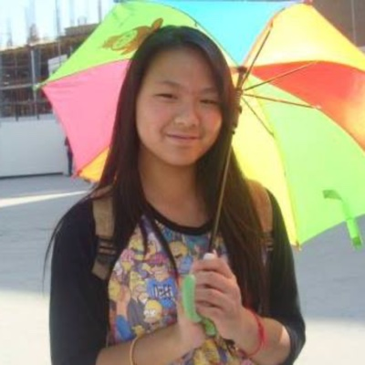
:::
::: {}
#### Paveetida Saengnuan (Namwan)
[B.S. Biology, MUIC · Class of 2020]{.role}

Project
: Systematic review of factors contributing to cassava productivity
:::
:::

### Class of 2019

::: {.person}
::: {.avatar}
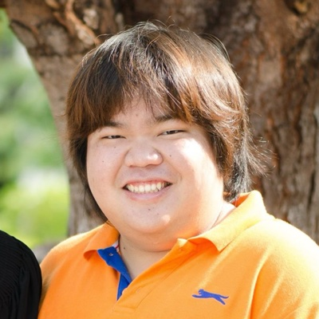
:::
::: {}
#### Purachet Phankien (Pu)
[M.S. Botany · Class of 2019]{.role}

Project
: Species diversity of *Leptolejeunea* in Thailand
:::
:::

::: {.person}
::: {.avatar}

:::
::: {}
#### Wannaporn Eiamsri (Pack)
[M.S. Botany · Class of 2019]{.role}

Project
: Diversity of bryophytes in Khao Chong
:::
:::

::: {.person}
::: {.avatar}
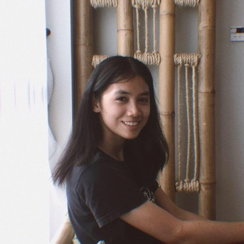
:::
::: {}
#### Sukanya Pumiretsuntorn (Som)
[B.S. Botany · Class of 2019]{.role}

Project
: Species richness of bryophytes in Sap Cham Pa swamp forest
:::
:::

::: {.person}
::: {.avatar}

:::
::: {}
#### Sawanphathu Kongkawai (Fah)
[B.S. Biology, MUIC · Class of 2019]{.role}

Project
: Molecular identification of Thai duckweeds by DNA barcoding
:::
:::

::: {.person}
::: {.avatar}

:::
::: {}
#### Ratdaporn Cheung (Minnie)
[B.S. Biology, MUIC · Class of 2019]{.role}

Project
: DNA barcoding for species of stingless bees in Thailand
:::
:::

### Class of 2018

::: {.person}
::: {.avatar}
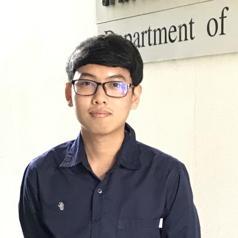
:::
::: {}
#### Pakawat Jarupand (Bom)
[B.S. Botany · Class of 2018]{.role}

Project
: DNA barcoding of *Sphagnum* in Thailand
:::
:::

### Class of 2017

::: {.person}
::: {.avatar}

:::
::: {}
#### Sorrasak Yodphaka (Peem)
[M.S. Botany (2017) · B.S. Botany (2015)]{.role}

Project (M.S.)
: DNA barcoding of epiphytic bryophytes in Thailand

Project (B.S.)
: Efficiency of DNA Barcoding of leafy liverworts *Cololejeunea*

:::
:::

::: {.person}
::: {.avatar}

:::
::: {}
#### Amarisa Noinakorn (Oum)
[B.S. Botany · Class of 2017]{.role}

Project
: Association of epiphytic bryophytes and host characters
:::
:::

### Class of 2016

::: {.person}
::: {.avatar}
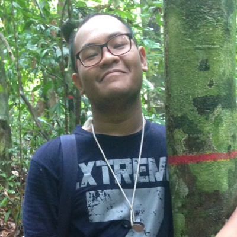
:::
::: {}
#### Panupong Kongwan (Mean)
[B.S. Botany · Class of 2016]{.role}

Project
: Association of epiphytic lichens and host characters
:::
:::

